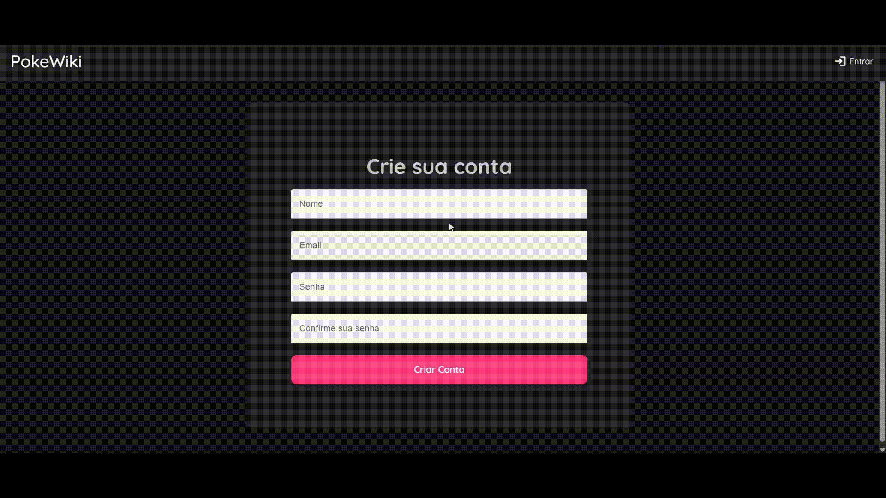
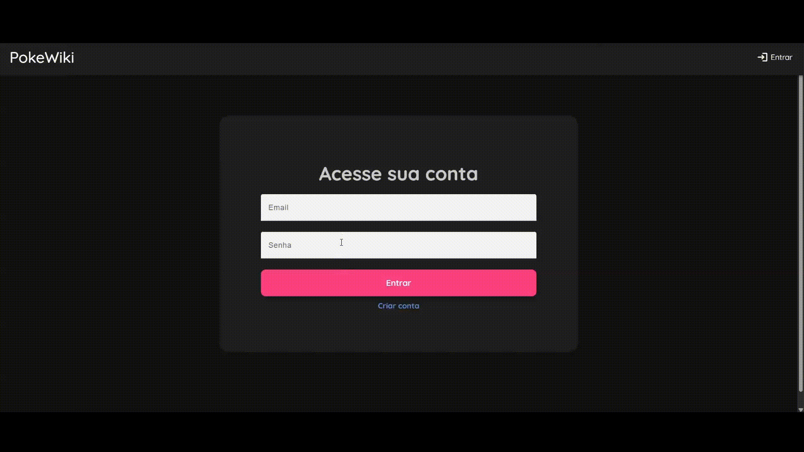
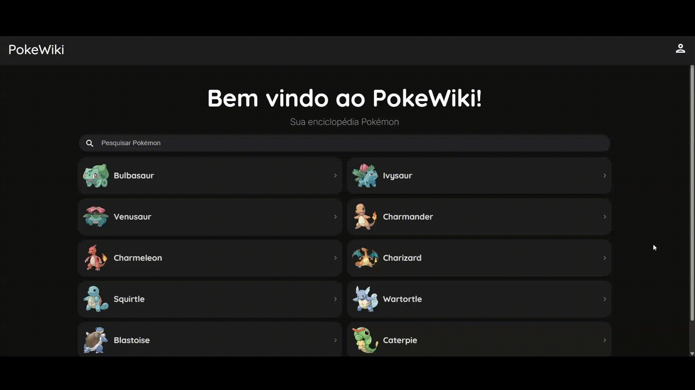
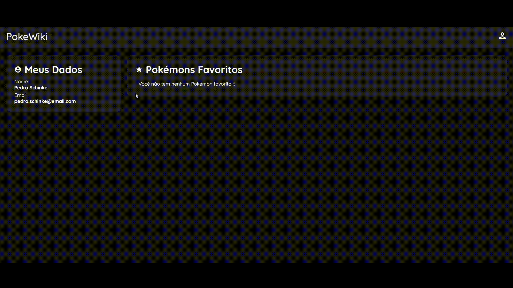

# PokeWiki

## Projeto para busca de dados de pokémons

### Sobre o projeto:
Minha ideia ao desenvolver esse projeto foi criar uma plataforma onde podemos buscar informações sobre qualquer Pokémon 
e favoritá-los na conta do usuário. Para desenvolver esse sistema, decidi construir o frontend com Angular + Ionic, 
que consome duas API's:

* [PokeAPI](https://pokeapi.co/): API pública para obter os dados dos pokémons
* [PokeWiki API](https://github.com/PedroSchinke/PokeWiki-API): API desenvolvida por mim para manejo de usuários e funcionalidades do software.

Meu estilo de codificação para esse projeto foi pragmático e orientado à entrega funcional, com uma organização modular 
voltada para a separação clara de responsabilidades (services, guards, etc.) e um estilo de escrita focado na fácil legibilidade.
Dentre os padrões de design utilizados no projeto, posso destacar: Service Layer, Injeção de Dependência e MVC (na API).

### Funcionalidades:

#### Cadastro de Usuário:

O frontend faz uma requisição para a minha API, que salva os dados de nome, email e senha criptografada em um banco de dados,
retornando um JWT e os dados do usuário, que são salvos em localstorage para serem exibidos na tela de perfil.

*A rota para cadastro de usuários é protegido por um Guard e só é acessível quando o usuário não está logado

#### Login:

O frontend envia os dados de email e senha para a minha API, que valida os dados e em caso de sucesso, retorna um JWT, os dados
do usuário e sua lista de pokémons favoritos, que são salvos em localstorage para serem exibidos na tela de perfil.

*A rota para cadastro de usuários é protegido por um Guard e só é acessível quando o usuário não está logado

#### Busca por Pokémons:

É possível navegar através de todos os pokémons da PokéApi ou pesquisar por um pokémon específico na página home do projeto, 
digitando seu nome na barra de pesquisa.

#### Favoritar Pokémon:

É possível favoritar um pokémon para que esse permaneça na lista de favoritos do usuário. O frontend faz uma requisição enviando o
id do pokémon para a minha API, que salva o favorito em uma tabela. Depois é possível visualizar esse pokémon em uma lista na tela
de perfil do usuário.

### Tecnologias usadas:
* Ionic
* Angular
* Material Components
* JWT
